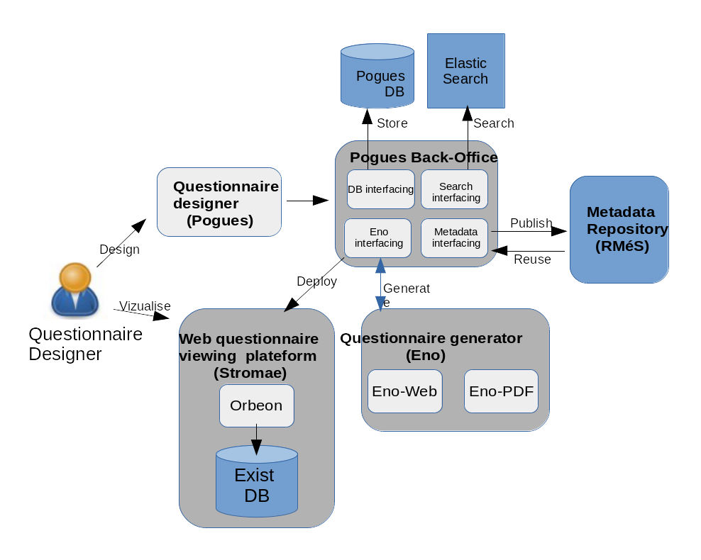
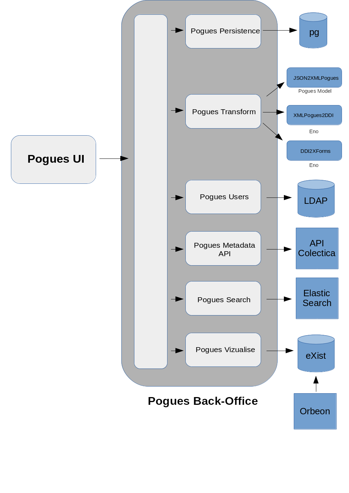

# Pogues

The following pages document the **backend** part of Pogues.

## Usefull resources:

 - [Frontend documentation (React)](http://inseefr.github.io/Pogues/fr/)

 - [Rest API Documentation (Swagger)](http://dvrmspogfolht01.ad.insee.intra/rmspogfo/swagger-ui/dist/index.html)
 
## About de Pogues

### Pogues Architecture Overview

 - The first figure is a global overview, describing how the backoffice application integrates with other components playing a role in Pogues architecture.
 

### Pogues Back Office Services

 - This other figure use a more fine grained approach to detail wich services the back office application provides to its clients

 

